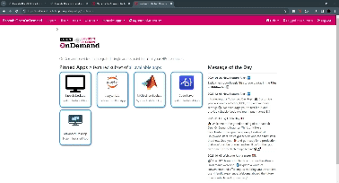
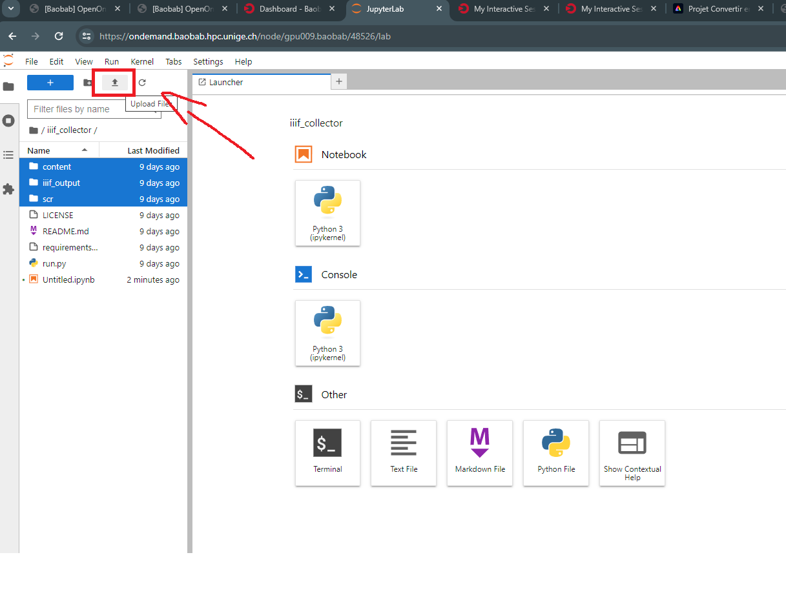
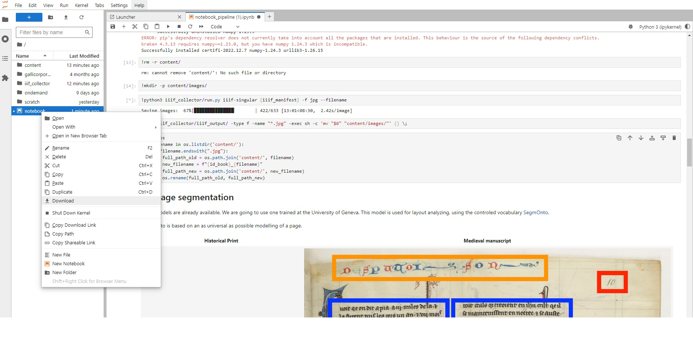
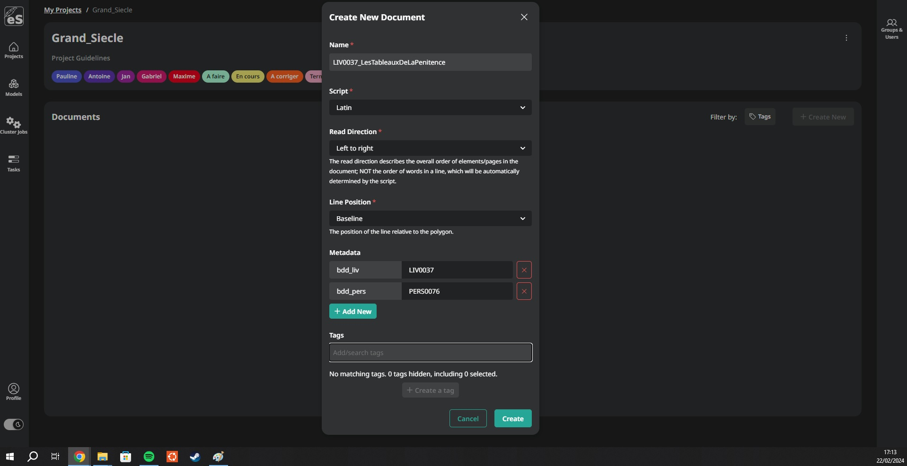
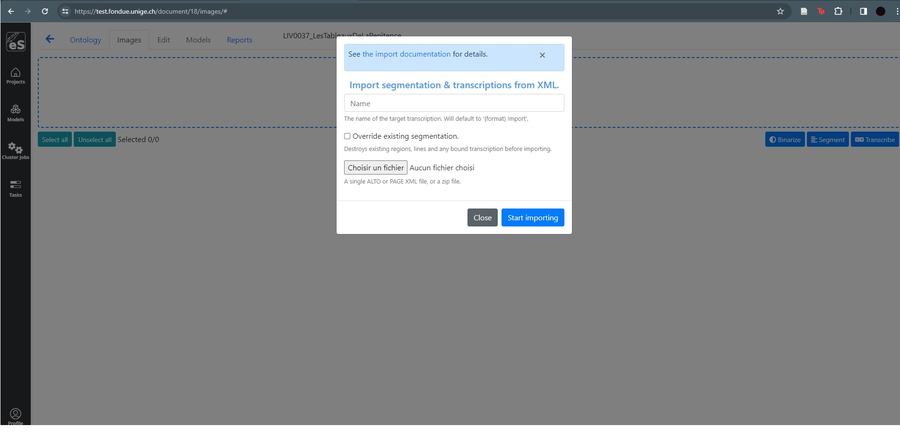

# iiif2alto - Easy Notebook pour l'HTR

Ces notebooks proviennent initialement du dépôt suivant : [Fondue - Documentation](https://github.com/FoNDUE-HTR/Documentation/blob/master/notebook_pipeline.ipynb). Nous pouvons remercier Simon Gabay, Ariane Pinche, Thibault Clérice, Kelly Christensen et Floriane Goy pour ce script ainsi que les services HPC de l'Université de Genève 

## Introduction

Deux notebooks ont été produits afin de convertir des images sous le format ALTO, un prêt à utiliser pour eScriptorium. La détection des zones s'appuie sur le vocabulaire controlé [SegmOnto](https://segmonto.github.io/) via [Yolov8](https://docs.ultralytics.com/fr/), le modèle BLLA pour la segmentation des lignes, et le moteur [Kraken](https://kraken.re/main/index.html) pour la reconnaissance de caractères.

XML-ALTO est l'encodage XML reconnu pour l'HTR. Il peut être importé sur eScriptorium ou diffuser auprès de la communauté. 

- Pour convertir des images depuis un manifeste IIIF : [Notebook](https://gitlab.unige.ch/grand_siecle/iiif2alto/-/blob/main/notebook_pipeline.ipynb)
- Pour convertir des images depuis un PDF : [Notebook]()

## Utilisation de JupyterLab

### OpenOnDemand

OpenOnDemand est un service fournit par le service HPC de l'Université de Genève pour faciliter l'utilisation du cluster.

Le site est accessible via cette adresse : [OpenOnDemand](https://ondemand.baobab.hpc.unige.ch/). Il faut en demander l'accès au préalable via le forum : [https://hpc-community.unige.ch/t/baobab-openondemand-is-now-available/3172](https://hpc-community.unige.ch/t/baobab-openondemand-is-now-available/3172). 

### Utilisation

- **Lancer son instance *Jupyter Lab***

Pour débuter une session, il faut se connecter via SWITCH puis sélectionner l'application *Jupyter Lab*. Il faut ensuite décrire sa configuration Hardware
 - Version : GCCcore/12.3.0 JupyterLab/4.0.5
    - Partition : shared-gpu
    - Nombre d'heure : dépend du nombre de fichiers à transcrire
    - CPU : dans l'idéal 2 coeurs
    - Memory : 4 Gb 
    - GPU: 1

Il faut bien estimer le nombre d'heure d'utilisation pour ne pas surcharger le serveur, donc prendre la place aux autres. Cliquer sur *Launch* pour lancer la session.

Ensuite, il faut cliquer sur *Connect to Jupyter* pour accéder à la session. Le bouton peut prendre un peu de temps à s'afficher, cela dépend de la disponibilité du cluster. Vous pouvez déposer le fichier .ipynb (Notebook) en amont dans l'onglet *Files* -> **Upload* ou directement dans l'espace JupyterLab sur le bouton upload (en dessous de Run)

Enfin il faut accéder à votre notebook en cliquant dessus. Le chargement peut prendre quelques secondes. Il faut impérativement renseigner les deux champs (au sein des parenthèses!) pour lancer le script :
- id_book : correspond à l'identifiant dans la base de données Livre
- iiif_manifest: lien du manifeste IIIF

Ensuite, il faut tout simplement aller dans *Run* -> *Run All Cells* et le script va se lancer. 

* N'oubliez pas de télécharger les fichiers zip (2) quand le script est terminé : clique droit sur le fichier et Download *

Si vous avez fini votre travail et qu'il reste du temps à votre session, n'hésitez pas à l'éteindre en cliquant sur le bouton Delete dans *My Interactive Sessions*. 

### eScriptorium

Voici quelques ressources concernant l'utilisation d'eScriptorium, application web pour la transcription HTR :
- Tutoriel eScriptorium général : [lien](https://lectaurep.hypotheses.org/documentation/prendre-en-main-escriptorium)
- Tutoriel eScriptorium complet : [lien](https://escriptorium.readthedocs.io/en/latest/)
- Code source : [lien](https://gitlab.com/scripta/escriptorium)

Dans notre cas, nous allons utiliser l'instance mis en place par l'Université de Genève *FoNDUE*.
- FoNDUE : [lien](https://test.fondue.unige.ch/)

#### Ajouter un document

Pour ajouter un nouveau document, il faut cliquer sur le bouton créer et completer le formulaire:
- Name : IDLivre_NomCourt
- script : Latin
- Read Direction : Left to right
- Line position : Baseline
- Metadata : bdd_liv et bdd_pers

N'oubliez pas d'ajouter les tags en fonction de l'avancer des travaux. 

Pour importer les images, il faut faire attention à la quantité afin de ne pas surcharger les serveurs. Au delà de 100 photos, il est conseiller d'importer par lot de 100 images afin d'éviter les incidents. Vous devez au préalable décompresser le fichier zip contenant les images.

Pour déposer les fichiers XML-ALTO une fois les images importées, vous devez cliquer sur *Import* puis *Transcription (XML)* et tout simplement déposer le fichier zip.

#### Restrancrire

**N.B.**: Cette option est intéressante si vous n'avez pas corriger le texte, mais uniquement la segmentation. Sinon votre travail sera perdu ... Il vaut mieux corriger après la retranscription.

Si vous souhaitez corriger la segmentation des lignes et des masks pour améliorer la transcription, vous devez sélectionner les images puis cliquer sur *Transcribe*. Sélectionner le modèle Emmental ou Gallicorpora+ pour les imprimés.
